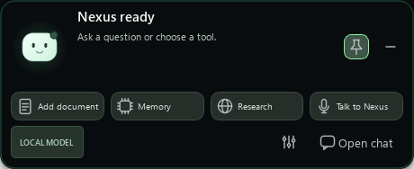

<div align="center">


# Nexus — Local AI Assistant for Windows

### Your local model. One shortcut away.

A local-first Windows desktop assistant for Ollama, LM Studio and llama.cpp — conversations, documents, voice, and memory you control.

**English** · [Türkçe](README.tr.md)

[](https://github.com/emiryigittt/nexus-local-ai-manager/actions/workflows/ci.yml)

</div>



*Actual interface rendered with synthetic example content; not a recorded model response.*

Nexus rests in a small strip at the top edge of your screen. Hover to reveal quick
tools, pin the mini panel, or click to open Chat. `Alt + Space` opens Chat or returns
to the strip. Drop PDF, DOCX or text files to add them to your local library.
Choose an RGB accent, optional slow rainbow glow, mini bot or cat, and optional
interface chimes under **Settings → Appearance**. Review memory in its new card view.
Nexus connects to an existing model server; it is not another hosted chatbot
and does not bundle a language model.

**0.3.0 Beta 1 · Public source beta · Windows-first.**
[Release and ZIP download](https://github.com/emiryigittt/nexus-local-ai-manager/releases/tag/v0.3.0-beta.1).
Install 64-bit Python 3.11–3.13, extract the source ZIP, then double-click
**Nexus Baslat.bat**. A running local model server is required.

The main window
and General/Privacy settings support English and Turkish. Voice, history, memory
dialogs and some status/error messages still include Turkish; full localization is unfinished.
A [local Windows installer build](docs/WINDOWS_PREVIEW.md) is available as a
development preview for testing. No public installer is included in this beta; the
PyQt/Qt distribution decision and dependency review remain open.
Known limits are described below.

Switch the interface under **Settings → General → Language → Save** (`Ctrl + ,`).
The first-run wizard also lets you choose the language and test a local model.
In Turkish: **Ayarlar → Genel → Dil → Kaydet**. No restart is needed.

[Get started](#get-started) · [User guide](docs/USER_GUIDE.md) ·
[Privacy](docs/PRIVACY.md) · [Contribute](CONTRIBUTING.md) · [Roadmap](ROADMAP.md)

[All documentation — English / Türkçe](docs/INDEX.md)

## What you can do

- **Meet Nexus:** a calm, consistent companion with a clear purpose. An optional
  introduction after setup asks your preferred name, interests, goal and response
  style. Review and save your answers; Nexus can ask occasional relevant questions
  to get to know you. [Identity and introduction guide](docs/IDENTITY.md).
- **Keep your chosen model:** discover LM Studio, Ollama, or llama.cpp servers and
  select a model already available locally.
- **Work from documents:** import PDF, DOCX, text, Markdown, or code and retrieve
  relevant passages. Scanned PDFs require text extraction/OCR elsewhere first.
- **Make memory explicit:** save a preference, inspect its source, review automatically
  proposed memories, and edit or forget them. Automatic candidates require approval.
- **Talk when useful:** local Whisper transcription, optional Supertonic speech,
  Windows speech fallback, or consent-driven Edge cloud speech.
- **Stay at the keyboard:** clipboard/selected-text context, searchable conversation
  history, reusable prompt actions, and streamed answers.
- **Reach outside deliberately:** `/web` supplies web sources; tools have permission
  controls. Their privacy boundaries differ from local chat.

## Get started

### 1. Start your local model

Use an installed [LM Studio](https://lmstudio.ai/), [Ollama](https://ollama.com/),
or [llama.cpp](https://github.com/ggml-org/llama.cpp) server with a loaded model.
Text chat does **not** require a vision model; image analysis does.

| Provider | Default API address Nexus scans |
| --- | --- |
| LM Studio | `http://127.0.0.1:1234/v1` |
| Ollama | `http://127.0.0.1:11434/v1` |
| llama.cpp | `http://127.0.0.1:8080/v1` |

Nexus does not install/start these servers. Hardware requirements depend on your
model. A matching API is necessary; model capabilities still vary.

### 2. Install from source

You need Windows and **64-bit Python 3.11–3.13**. Earlier Windows CI passed on
these versions; the current release is gated on fresh CI. Python 3.14 has known intermittent
native access violations during tests and subprocess-cleanup warnings. A clean-machine
compatibility check is pending. See the [latest local verification](docs/PREPUBLICATION_CHECK.md).

Download **Source code (zip)** from the
[beta release](https://github.com/emiryigittt/nexus-local-ai-manager/releases/tag/v0.3.0-beta.1),
extract it completely, then double-click **Nexus Baslat.bat**. The launcher
prepares dependencies and opens the connection wizard. For manual installation,
open a terminal in the extracted folder and use the commands below.

With Git, you can instead clone the repository:

```powershell
git clone https://github.com/emiryigittt/nexus-local-ai-manager.git
cd nexus-local-ai-manager
```

Then install and start Nexus:

```powershell
python -m venv .venv
.\.venv\Scripts\python.exe -m pip install -r requirements.txt
.\.venv\Scripts\python.exe run_nexus.py
```

No PowerShell activation-policy change is needed. Alternatively, double-click
`Nexus Baslat.bat` to create the environment, install dependencies, and start Nexus.
Initial dependency/model downloads need internet access.

### 3. Choose a model and try one useful task

In Settings (**Ayarlar → Genel**), scan local providers, select the loaded model,
and save. Try: “Help me plan three focused tasks for today.”

Next, add the [synthetic project brief](docs/demo/project-brief.md) using **Ekle**,
enable **Araçlar → Belgelerimden yanıtla**, and ask: “What are the three release
priorities in this document?” No personal document is needed for this first test.

Optional voice setup: run `Yerel Ses Kur.bat`, then choose a backend under
**Ayarlar → Ses** and enable **Araçlar → Yanıtları seslendir**. Supertonic is a
separate model download with separate license terms; its upstream repository is
archived. See [voice notes](docs/VOICE_AND_MEMORY_RELIABILITY.en.md).

For memory, start with `/remember I prefer concise answers`. Automatic learning
is separately opt-in; candidates appear under **Araçlar → Hafızayı yönet** and
must be activated. Turn on memory use under **Ayarlar → Gizlilik** for retrieval.

## Local by default, not “nothing ever leaves”

With loopback provider addresses, chat inference stays on your computer. Normal
history, imported document text, and memory are stored locally in SQLite, **not
encrypted by Nexus**. Private chat avoids Nexus conversation/memory persistence;
it does not disable logging by another program or permitted network features.

| Feature | Boundary |
| --- | --- |
| Chat / image analysis | Configured model endpoint; keep it local |
| Transcription / local speech | Local inference after model installation |
| `/web` | Search queries and page URLs go to external services with permission |
| Edge speech | Spoken text goes to an online service with speech consent |
| Third-party MCP tools | Separate processes; review their permissions and behavior |

The local API currently has **no authentication**. Keep it on `127.0.0.1`; do not
expose it to a LAN, proxy, or public tunnel. [Privacy and security boundaries](docs/PRIVACY.md).

## Current status

| Area | What is verified / what remains |
| --- | --- |
| Automated checks | 377 tests, Ruff and 13 packaged smoke checks passed locally on 1 October 2026. The source beta publishes only after fresh Windows CI on Python 3.11–3.13 passes. [Verification details](docs/PREPUBLICATION_CHECK.md) |
| Local speech | Two segments completed real Qt playback; naturalness needs listening tests |
| Memory | Candidate persistence/approval tested; current live-model recall check awaits a running server |
| Hey Nexus | Opt-in experiment; missed triggers and CPU use remain. Use `F2` as fallback |
| Compatibility | Windows 10/11 x64 target; clean-PC installation testing pending. No public installer or macOS/Linux support claim |

Speech uses text segments rather than true PCM streaming. Captions follow playback;
cloud word timings are supplied by the service and local word alignment is approximate.
Speech input now finishes after a configurable pause, balances quiet input and offers
optional transcript review. These changes have not established accuracy with your
physical microphone. Model answers can be wrong. See [verification scope](docs/VOICE_AND_MEMORY_RELIABILITY.en.md)
and [troubleshooting](docs/USER_GUIDE.md#troubleshooting).

## Help shape Nexus

Useful contributions include reproducible bugs with synthetic examples, English UI
localization, keyboard accessibility, and Turkish speech test cases. Start with
[CONTRIBUTING](CONTRIBUTING.md) and the [small-task briefs](docs/GOOD_FIRST_ISSUES.md).
Never attach your database, credentials, private documents, or unredacted logs.

```powershell
.\.venv\Scripts\python.exe -m pip install -r requirements-dev.txt
.\.venv\Scripts\python.exe -m pytest
.\.venv\Scripts\python.exe -m ruff check .
.\.venv\Scripts\python.exe scripts\check_public_repo.py
```

## License

Nexus-authored source is available under [MIT](LICENSE). Dependencies, models, and
voices are **not relicensed by this repository**. PyQt6's GPL/commercial terms and
model licenses require separate consideration before distribution; no bundled
binary is offered. See [third-party notices and release gates](THIRD_PARTY_NOTICES.md).

If Nexus helps with your daily work, a star or concrete usage report helps others
discover it. Neither requires sharing personal data.
