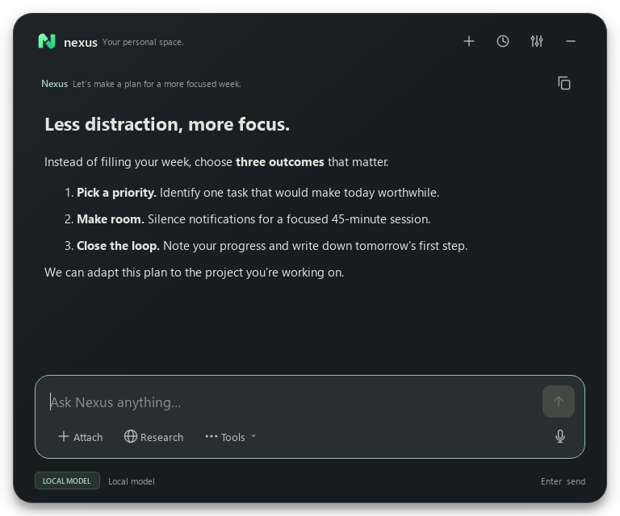

<div align="center">


# Nexus — Local AI Assistant for Windows

### Your local model. One shortcut away.

A local-first Windows desktop assistant for Ollama, LM Studio and llama.cpp — conversations, documents, voice, and memory you control.

**English** · [Türkçe](README.tr.md)

[](https://github.com/emiryigittt/nexus-local-ai-manager/actions/workflows/ci.yml)

</div>



*Actual interface rendered with synthetic example content; not a recorded model response.*

Press `Alt + Space`, bring a question or document, and work with the local model you
choose. Nexus connects to an existing model server; it is not another hosted chatbot
and does not bundle a language model.

**Development preview · Windows-first · Source installation only.** The main window
and General/Privacy settings support English and Turkish. Voice, history, memory
dialogs and some status/error messages still include Turkish; full localization is unfinished.
There is no Windows installer yet. Known limits are described below.

Switch the interface under **Settings → General → Language → Save** (`Ctrl + ,`).
In Turkish: **Ayarlar → Genel → Dil → Kaydet**. No restart is needed.

[Get started](#get-started) · [User guide](docs/USER_GUIDE.md) ·
[Privacy](docs/PRIVACY.md) · [Contribute](CONTRIBUTING.md) · [Roadmap](ROADMAP.md)

[All documentation — English / Türkçe](docs/INDEX.md)

## What you can do

- **Keep your chosen model:** discover LM Studio, Ollama, or llama.cpp servers and
  select a model already available locally.
- **Work from documents:** import PDF, DOCX, text, Markdown, or code and retrieve
  relevant passages. Scanned PDFs require text extraction/OCR elsewhere first.
- **Make memory explicit:** save a preference, inspect its source, review automatically
  proposed memories, and edit or forget them. Automatic candidates require approval.
- **Talk when useful:** local Whisper transcription, optional Supertonic speech,
  Windows speech fallback, or consent-driven Edge cloud speech.
- **Stay at the keyboard:** clipboard/selected-text context, searchable conversation
  history, reusable prompt actions, and streamed answers.
- **Reach outside deliberately:** `/web` supplies web sources; tools have permission
  controls. Their privacy boundaries differ from local chat.

## Get started

### 1. Start your local model

Use an installed [LM Studio](https://lmstudio.ai/), [Ollama](https://ollama.com/),
or [llama.cpp](https://github.com/ggml-org/llama.cpp) server with a loaded model.
Text chat does **not** require a vision model; image analysis does.

| Provider | Default API address Nexus scans |
| --- | --- |
| LM Studio | `http://127.0.0.1:1234/v1` |
| Ollama | `http://127.0.0.1:11434/v1` |
| llama.cpp | `http://127.0.0.1:8080/v1` |

Nexus does not install/start these servers. Hardware requirements depend on your
model. A matching API is necessary; model capabilities still vary.

### 2. Install from source

You need Windows and **64-bit Python 3.11+**. Windows CI has passed on Python
3.11–3.13. Python 3.14 has known intermittent
native access violations during tests and subprocess-cleanup warnings. A clean-machine
compatibility check is pending. See the [latest local verification](docs/PREPUBLICATION_CHECK.md).

Download this repository using **Code → Download ZIP**, extract it, then open a
terminal in the extracted folder. Run:

With Git, you can instead clone the repository:

```powershell
git clone https://github.com/emiryigittt/nexus-local-ai-manager.git
cd nexus-local-ai-manager
```

Then install and start Nexus:

```powershell
python -m venv .venv
.\.venv\Scripts\python.exe -m pip install -r requirements.txt
.\.venv\Scripts\python.exe run_nexus.py
```

No PowerShell activation-policy change is needed. Alternatively, double-click
`Nexus Baslat.bat` to create the environment, install dependencies, and start Nexus.
Initial dependency/model downloads need internet access.

### 3. Choose a model and try one useful task

In Settings (**Ayarlar → Genel**), scan local providers, select the loaded model,
and save. Try: “Help me plan three focused tasks for today.”

Next, add the [synthetic project brief](docs/demo/project-brief.md) using **Ekle**,
enable **Araçlar → Belgelerimden yanıtla**, and ask: “What are the three release
priorities in this document?” No personal document is needed for this first test.

Optional voice setup: run `Yerel Ses Kur.bat`, then choose a backend under
**Ayarlar → Ses** and enable **Araçlar → Yanıtları seslendir**. Supertonic is a
separate model download with separate license terms; its upstream repository is
archived. See [voice notes](docs/VOICE_AND_MEMORY_RELIABILITY.en.md).

For memory, start with `/remember I prefer concise answers`. Automatic learning
is separately opt-in; candidates appear under **Araçlar → Hafızayı yönet** and
must be activated. Turn on memory use under **Ayarlar → Gizlilik** for retrieval.

## Local by default, not “nothing ever leaves”

With loopback provider addresses, chat inference stays on your computer. Normal
history, imported document text, and memory are stored locally in SQLite, **not
encrypted by Nexus**. Private chat avoids Nexus conversation/memory persistence;
it does not disable logging by another program or permitted network features.

| Feature | Boundary |
| --- | --- |
| Chat / image analysis | Configured model endpoint; keep it local |
| Transcription / local speech | Local inference after model installation |
| `/web` | Search queries and page URLs go to external services with permission |
| Edge speech | Spoken text goes to an online service with speech consent |
| Third-party MCP tools | Separate processes; review their permissions and behavior |

The local API currently has **no authentication**. Keep it on `127.0.0.1`; do not
expose it to a LAN, proxy, or public tunnel. [Privacy and security boundaries](docs/PRIVACY.md).

## Current status

| Area | What is verified / what remains |
| --- | --- |
| Automated checks | [Windows CI passed](https://github.com/emiryigittt/nexus-local-ai-manager/actions/runs/36627956686) on Python 3.11–3.13 on 29 September 2026. All 262 tests passed locally on retry; the Python 3.14 native crash remains unresolved. [Verification details](docs/PREPUBLICATION_CHECK.md) |
| Local speech | Two segments completed real Qt playback; naturalness needs listening tests |
| Memory | Candidate persistence/approval tested; current live-model recall check awaits a running server |
| Hey Nexus | Opt-in experiment; missed triggers and CPU use remain. Use `F2` as fallback |
| Compatibility | Windows-first; no installer or macOS/Linux support claim |

Speech uses text segments, not true PCM streaming or word-level synchronized
highlighting. Model answers can be wrong. See [verification scope](docs/VOICE_AND_MEMORY_RELIABILITY.en.md)
and [troubleshooting](docs/USER_GUIDE.md#troubleshooting).

## Help shape Nexus

Useful contributions include reproducible bugs with synthetic examples, English UI
localization, keyboard accessibility, and Turkish speech test cases. Start with
[CONTRIBUTING](CONTRIBUTING.md) and the [small-task briefs](docs/GOOD_FIRST_ISSUES.md).
Never attach your database, credentials, private documents, or unredacted logs.

```powershell
.\.venv\Scripts\python.exe -m pip install -r requirements-dev.txt
.\.venv\Scripts\python.exe -m pytest
.\.venv\Scripts\python.exe -m ruff check .
.\.venv\Scripts\python.exe scripts\check_public_repo.py
```

## License

Nexus-authored source is available under [MIT](LICENSE). Dependencies, models, and
voices are **not relicensed by this repository**. PyQt6's GPL/commercial terms and
model licenses require separate consideration before distribution; no bundled
binary is offered. See [third-party notices and release gates](THIRD_PARTY_NOTICES.md).

If Nexus helps with your daily work, a star or concrete usage report helps others
discover it. Neither requires sharing personal data.
