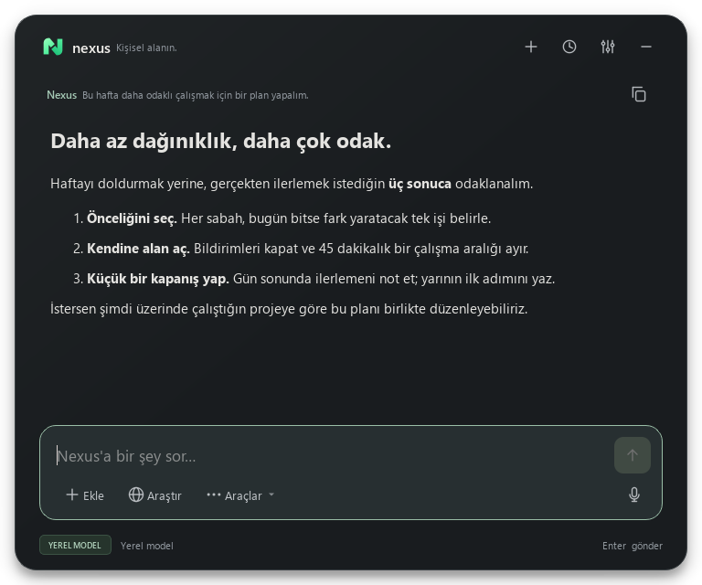

<div align="center">


# Nexus — Windows için Yerel Yapay Zekâ Asistanı

### Seçtiğin yerel model. Tek kısayol uzağında.

Ollama, LM Studio ve llama.cpp ile sohbet, belgeler, ses ve kontrolü sende olan kişisel hafıza için yerel öncelikli Windows asistanı.

[English](README.md) · **Türkçe**

</div>



*Gerçek arayüzün yapay örnek içerikle oluşturulmuş görüntüsüdür; kaydedilmiş bir model yanıtı değildir.*

`Alt + Space` ile aç, sorunu veya belgeni getir, seçtiğin yerel modelle çalış.
Nexus bir model sunucusuna bağlanır; bulut sohbet hizmeti değildir ve dil modeli içermez.

**Geliştirme önizlemesi · Windows odaklı · Kaynak koddan kurulum.** Henüz Windows
kurulum paketi yok. Ana pencere ve Genel/Gizlilik ayarları Türkçe ve İngilizceyi
destekliyor. Ses, geçmiş, hafıza pencereleri ve bazı durum/hata mesajları hâlâ
Türkçe içeriyor; tam arayüz çevirisi tamamlanmadı.

**Ayarlar → Genel → Dil → Kaydet** (`Ctrl + ,`) üzerinden dili değiştirebilirsin.
Yeniden başlatmak gerekmez.

[Başlangıç](#başlangıç) · [Kullanım rehberi](docs/USER_GUIDE.tr.md) ·
[Gizlilik](docs/PRIVACY.tr.md) · [Katkı](CONTRIBUTING.tr.md) · [Yol haritası — EN](ROADMAP.md)

[Tüm belgeler — Türkçe / English](docs/INDEX.md)

## Neler yapabilirsin?

- **Modelini kendin seç:** çalışan LM Studio, Ollama ve llama.cpp sunucularını bul.
- **Belgelerinle çalış:** PDF, DOCX, metin, Markdown veya kod ekleyip ilgili
  bölümler üzerinden yanıt al. Taranmış PDF'ler için önce ayrı bir OCR işlemi gerekir.
- **Hafızayı yönet:** tercihlerini kaydet, otomatik önerilen kayıtları inceleyip
  onayla, düzenle veya unuttur. Aday kayıtlar onaylanmadan kullanılmaz.
- **Sesli iletişim kur:** yerel Whisper, isteğe bağlı Supertonic, Windows sesi
  veya ayrıca izin verdiğin Edge bulut sesiyle çalış.
- **Klavyeden ayrılma:** pano/seçili metin, sohbet geçmişi, hazır komutlar ve akış halinde yanıtlar.
- **Gerektiğinde internete çık:** `/web` ile kaynaklı araştırma yap. Web ve
  üçüncü taraf araçların gizlilik sınırları yerel sohbetten farklıdır.

## Başlangıç

### 1. Yerel modelini aç

Kurulu [LM Studio](https://lmstudio.ai/), [Ollama](https://ollama.com/) veya
[llama.cpp](https://github.com/ggml-org/llama.cpp) sunucusunda bir model yükle.
Metin sohbeti için görsel anlayan model şart değil; görsel analizi için gerekli.

| Sağlayıcı | Nexus'un taradığı varsayılan adres |
| --- | --- |
| LM Studio | `http://127.0.0.1:1234/v1` |
| Ollama | `http://127.0.0.1:11434/v1` |
| llama.cpp | `http://127.0.0.1:8080/v1` |

Nexus bu sunucuları kurmaz veya başlatmaz. RAM/GPU ihtiyacı seçtiğin modele bağlıdır.

### 2. Nexus'u kur

Windows ve **64 bit Python 3.11+** gerekir. Yapılandırılmış Windows CI matrisi
3.11–3.13'ü hedefler; GitHub testlerinin çalıştığı henüz doğrulanmadı. Python 3.14'te
testler sırasında aralıklı yerel erişim ihlalleri ve işlem kapanış uyarıları var.
Temiz bilgisayarda kurulum testi bekliyor. [Son yerel doğrulama](docs/PREPUBLICATION_CHECK.md).

Bu depoda **Code → Download ZIP** ile indir, arşivi çıkar ve çıkan klasörde terminal aç:

Git kullanıyorsan depoyu klonlayabilirsin:

```powershell
git clone https://github.com/emiryigittt/nexus-local-ai-manager.git
cd nexus-local-ai-manager
```

Ardından Nexus'u kur ve başlat:

```powershell
python -m venv .venv
.\.venv\Scripts\python.exe -m pip install -r requirements.txt
.\.venv\Scripts\python.exe run_nexus.py
```

PowerShell çalıştırma politikasını değiştirmen gerekmez. Alternatif olarak
`Nexus Baslat.bat` dosyasına çift tıklayabilirsin. İlk indirmeler internet ister.

### 3. İlk işini tamamla

**Ayarlar → Genel** bölümünde sağlayıcıları tara, yüklü modelini seç ve kaydet.
“Bugün odaklanacağım üç işi planlamama yardım et” diyerek başla.

Sonra [örnek proje belgesini](docs/demo/project-brief.md) **Ekle** ile içeri al,
**Araçlar → Belgelerimden yanıtla** seçeneğini aç ve “Bu belgedeki üç yayın
önceliği nedir?” diye sor. İlk denemede kişisel belge kullanmana gerek yok.

Ses için isteğe bağlı `Yerel Ses Kur.bat` dosyasını çalıştır. **Ayarlar → Ses**
altından motorunu seç ve **Araçlar → Yanıtları seslendir** seçeneğini aç.
Supertonic ayrı lisanslı bir modeldir ve ana deposu arşivlenmiştir;
[ses araştırması ve ölçümler](docs/VOICE_AND_MEMORY_RELIABILITY.md) bu sınırları açıklar.

Hafıza için `/hatırla Kısa Türkçe yanıtları tercih ederim` komutunu dene.
**Ayarlar → Gizlilik** içinde hafızayı kullanmayı aç. Otomatik aday çıkarma ayrı
izindir; oluşan adayları **Araçlar → Hafızayı yönet** bölümünden etkinleştir.

## Yerel öncelikli; koşulsuz “hiçbir şey dışarı çıkmaz” değil

Model adresi kendi bilgisayarını gösteriyorsa sohbet çıkarımı yerelde kalır.
Normal sohbetler, belge metinleri ve hafıza yerel SQLite'ta tutulur;
**Nexus bunları şifrelemez**. Özel oturum Nexus sohbet/hafıza kaydını önler,
ancak başka programların kayıtlarını veya izinli ağ işlemlerini engellemez.

| Özellik | Veri sınırı |
| --- | --- |
| Sohbet / görsel | Yapılandırdığın model sunucusu; adresi yerel tut |
| Transkripsiyon / yerel ses | Model indirildikten sonra yerel çıkarım |
| `/web` | İzinle dış hizmetlere arama sorgusu ve sayfa adresleri |
| Edge sesi | Ses izniyle çevrimiçi hizmete okunacak metin |
| Üçüncü taraf MCP araçları | Ayrı süreçler; izinlerini ve davranışlarını incele |

Yerel API şu an **kimlik doğrulama içermiyor**. `127.0.0.1` üzerinde tut;
yerel ağa veya herkese açık tünele açma. [Gizlilik sınırları](docs/PRIVACY.tr.md).

## Durum ve sınırlamalar

- 29 Eylül 2026'da yerelde 262 test geçti; önceki koşu aralıklı bir çöküşle kesildi.
  [Doğrulama ayrıntıları](docs/PREPUBLICATION_CHECK.md); bu bir GitHub CI rozeti değil.
- Yerel seste iki parçanın oynatımı doğrulandı; doğallık için dinleme testleri bekliyor.
- Hafıza kayıt/onay testleri geçti; gerçek modelle oturumlar arası hatırlama kontrolü açık.
- “Hey Nexus” ayrı izinli, deneysel bir özellik; tetiklemeleri kaçırabilir. `F2` alternatifini kullan.
- Ses parça parça hazırlanır; gerçek ses akışı veya kelime düzeyinde senkronizasyon yok.
- Windows dışındaki sistemler için destek ve hazır kurulum paketi taahhüdü yok.

Sorun yaşarsan [kullanım ve sorun giderme rehberine](docs/USER_GUIDE.tr.md) bak.
Hatalı model yanıtları mümkündür; önemli bilgileri doğrula.

## Katkı ve lisans

Hata örneği, İngilizce arayüz çevirisi, erişilebilirlik veya Türkçe ses testleriyle
katkı verebilirsin. [Katkı rehberi](CONTRIBUTING.tr.md) ve
[ilk görev taslakları](docs/GOOD_FIRST_ISSUES.tr.md) başlangıç noktalarıdır.
Veritabanını, özel belgelerini, anahtarlarını veya temizlenmemiş kayıtları paylaşma.

Nexus'un kendi kaynak kodu [MIT](LICENSE) lisanslıdır. Bağımlılıklar ve modeller
ayrı koşullara tabidir; özellikle PyQt6 ve model lisansları dağıtım öncesi
incelenmelidir. [Üçüncü taraf notları](THIRD_PARTY_NOTICES.tr.md).

İşine yarıyorsa yıldız vermen veya somut kullanım geri bildirimi paylaşman projenin
keşfedilmesine yardımcı olur. Kişisel verilerini paylaşman gerekmez.
