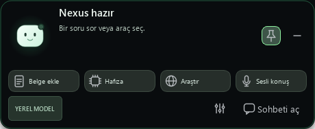
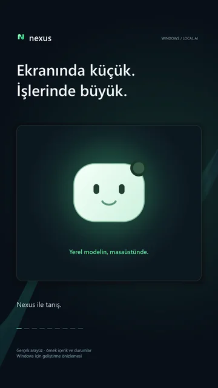
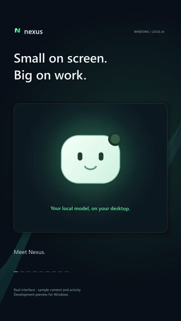

<div align="center">


# Nexus — Windows için Yerel Yapay Zekâ Asistanı

### Seçtiğin yerel model. Tek kısayol uzağında.

Ollama, LM Studio ve llama.cpp ile sohbet, belgeler, ses ve kontrolü sende olan kişisel hafıza için yerel öncelikli Windows asistanı.

[English](README.md) · **Türkçe**

[](https://github.com/emiryigittt/nexus-local-ai-manager/actions/workflows/ci.yml)

[▶ Nexus tanıtımı · Türkçe / English · 50s](#nexusu-50-saniyede-tanı)

</div>



*Gerçek arayüzün yapay örnek içerikle oluşturulmuş görüntüsüdür; kaydedilmiş bir model yanıtı değildir.*

Nexus ekranın üst kenarında küçük bir şerit olarak durur. Üzerine gelince araçları
görürsün; mini paneli sabitleyebilir veya tıklayıp sohbeti açabilirsin. `Alt + Space`
sohbeti açar ya da üst şeride döndürür. PDF, DOCX veya metin dosyasını pencereye
sürükleyip yerel kitaplığına ekleyebilirsin. **Ayarlar → Görünüm** bölümünden RGB
rengini, isteğe bağlı kenar ışığını, mini bot veya kediyi ve ses efektlerini seç.
Hafıza kayıtlarını yenilenen kart görünümünden incele, onayla ve düzenle.
Nexus bir model sunucusuna bağlanır; bulut sohbet hizmeti değildir ve dil modeli içermez.

**0.3.0 Beta 2 · Windows kurulum paketi · Açık kaynak.**
[NexusSetup.exe dosyasını indir](https://github.com/emiryigittt/nexus-local-ai-manager/releases/download/v0.3.0-beta.2/NexusSetup.exe)
veya [sürüm sayfasını aç](https://github.com/emiryigittt/nexus-local-ai-manager/releases/tag/v0.3.0-beta.2).
Kurulumu çalıştır ve Başlat menüsünden Nexus'u aç. Python veya terminal gerekmez.
Çalışan Ollama, LM Studio veya llama.cpp sunucusuna bağlanıp modelini seç.

Kurulum imzasızdır; Windows yayıncı uyarısı gösterebilir. Dosyayı sürümdeki
`SHA256SUMS.txt` ile doğrulayabilirsin. Birleşik Windows uygulaması
[GNU GPL v3](DISTRIBUTION_LICENSE.tr.md) kapsamında; eşleşen kaynak arşivleri ve
bağımlılık bildirimleriyle sunulur. Nexus'un kendi kaynak kodu MIT lisansını korur.
LLM, Whisper ve Supertonic ağırlıkları pakete dahil değildir; isteğe bağlı konuşma
modelleri Ayarlar bölümünden açık bir işlemle hazırlanır.

Ana pencere ve Genel/Gizlilik ayarları Türkçe ve İngilizceyi destekler.
Bazı ses, geçmiş, hafıza ve durum mesajları hâlâ Türkçedir.
[Kurulum ve derleme rehberine](docs/WINDOWS_PREVIEW.tr.md) ve aşağıdaki sınırlara bak.

**Ayarlar → Genel → Dil → Kaydet** (`Ctrl + ,`) üzerinden dili değiştirebilirsin.
İlk açılış sihirbazı da dili seçip yerel modelini test etmeni sağlar.
Yeniden başlatmak gerekmez.

[Başlangıç](#başlangıç) · [Kullanım rehberi](docs/USER_GUIDE.tr.md) ·
[Gizlilik](docs/PRIVACY.tr.md) · [Katkı](CONTRIBUTING.tr.md) · [Yol haritası — EN](ROADMAP.md)

[Tüm belgeler — Türkçe / English](docs/INDEX.md)

## Nexus'u 50 saniyede tanı

Küçük masaüstü panelini, sevimli yardımcıyı, RGB temalarını ve hafızayı tanı. Aşağıdan video dilini seç.

<table>
<tr>
<td align="center"><a href="https://github.com/user-attachments/assets/5f4b67f6-b371-467c-84b4-4c32fdb32fe2"></a><br><a href="https://github.com/user-attachments/assets/5f4b67f6-b371-467c-84b4-4c32fdb32fe2"><strong>▶ Türkçe · 50s</strong></a></td>
<td align="center"><a href="https://github.com/user-attachments/assets/3bb373f0-6cb6-415b-8d06-8b5dfdbcdb64"></a><br><a href="https://github.com/user-attachments/assets/3bb373f0-6cb6-415b-8d06-8b5dfdbcdb64"><strong>▶ English · 50s</strong></a></td>
</tr>
</table>

<details>
<summary>Bu sayfada oynat — Türkçe · 50s</summary>

https://github.com/user-attachments/assets/5f4b67f6-b371-467c-84b4-4c32fdb32fe2

</details>

<details>
<summary>Bu sayfada oynat — English · 50s</summary>

https://github.com/user-attachments/assets/3bb373f0-6cb6-415b-8d06-8b5dfdbcdb64

</details>

*Gerçek Nexus arayüzü, yapay örnek içerik ve etkinliklerle gösterilir; kaydedilmiş bir model yanıtı değildir. Müzik ve ses efektleri içerir, sesli anlatım yoktur.*

Orijinal videoları indir: [English](https://github.com/emiryigittt/nexus-local-ai-manager/releases/download/v0.3.0-beta.2/nexus-social-film-en-50s-v2.mp4) · [Türkçe](https://github.com/emiryigittt/nexus-local-ai-manager/releases/download/v0.3.0-beta.2/nexus-social-film-tr-50s-v2.mp4)

## Neler yapabilirsin?

- **Nexus ile tanış:** amacını bilen, sakin ve tutarlı bir yardımcı. İlk kurulumdan
  sonra adını, uğraşlarını, hedefini ve yanıt tercihlerini isteğe bağlı sorar.
  Kayıtları gözden geçirip sen kaydedersin; uygun anlarda seni daha iyi tanımak için
  kısa sorular sorabilir. [Kimlik ve tanışma rehberi](docs/IDENTITY.tr.md).
- **Modelini kendin seç:** çalışan LM Studio, Ollama ve llama.cpp sunucularını bul.
- **Belgelerinle çalış:** PDF, DOCX, metin, Markdown veya kod ekleyip ilgili
  bölümler üzerinden yanıt al. Taranmış PDF'ler için önce ayrı bir OCR işlemi gerekir.
- **Hafızayı yönet:** tercihlerini kaydet, otomatik önerilen kayıtları inceleyip
  onayla, düzenle veya unuttur. Aday kayıtlar onaylanmadan kullanılmaz.
- **Sesli iletişim kur:** yerel Whisper, isteğe bağlı Supertonic, Windows sesi
  veya ayrıca izin verdiğin Edge bulut sesiyle çalış.
- **Klavyeden ayrılma:** pano/seçili metin, sohbet geçmişi, hazır komutlar ve akış halinde yanıtlar.
- **Gerektiğinde internete çık:** `/web` ile kaynaklı araştırma yap. Web ve
  üçüncü taraf araçların gizlilik sınırları yerel sohbetten farklıdır.

## Başlangıç

### 1. Yerel modelini aç

Kurulu [LM Studio](https://lmstudio.ai/), [Ollama](https://ollama.com/) veya
[llama.cpp](https://github.com/ggml-org/llama.cpp) sunucusunda bir model yükle.
Metin sohbeti için görsel anlayan model şart değil; görsel analizi için gerekli.

| Sağlayıcı | Nexus'un taradığı varsayılan adres |
| --- | --- |
| LM Studio | `http://127.0.0.1:1234/v1` |
| Ollama | `http://127.0.0.1:11434/v1` |
| llama.cpp | `http://127.0.0.1:8080/v1` |

Nexus bu sunucuları kurmaz veya başlatmaz. RAM/GPU ihtiyacı seçtiğin modele bağlıdır.

### 2. Nexus'u kur

Windows ve **64 bit Python 3.11–3.13** gerekir. Önceki GitHub Windows CI kontrolleri
bu sürümlerde geçti; yeni beta yayını güncel CI başarısına bağlıdır. Python 3.14'te
testler sırasında aralıklı yerel erişim ihlalleri ve işlem kapanış uyarıları var.
Kurulum, tekrar kurulum ve kaldırma otomatik olarak temiz Windows ortamında kontrol edilir. [Son yerel doğrulama](docs/PREPUBLICATION_CHECK.md).

[Beta sürümünün](https://github.com/emiryigittt/nexus-local-ai-manager/releases/tag/v0.3.0-beta.1)
**Source code (zip)** dosyasını indir, tamamen çıkar ve **Nexus Baslat.bat** dosyasına
çift tıkla. Başlatıcı bağımlılıkları hazırlayıp bağlantı sihirbazını açar.
Elle kurmak istersen çıkan klasörde terminal aç ve aşağıdaki komutları kullan.

Git kullanıyorsan depoyu klonlayabilirsin:

```powershell
git clone https://github.com/emiryigittt/nexus-local-ai-manager.git
cd nexus-local-ai-manager
```

Ardından Nexus'u kur ve başlat:

```powershell
python -m venv .venv
.\.venv\Scripts\python.exe -m pip install -r requirements.txt
.\.venv\Scripts\python.exe run_nexus.py
```

PowerShell çalıştırma politikasını değiştirmen gerekmez. Alternatif olarak
`Nexus Baslat.bat` dosyasına çift tıklayabilirsin. İlk indirmeler internet ister.

### 3. İlk işini tamamla

**Ayarlar → Genel** bölümünde sağlayıcıları tara, yüklü modelini seç ve kaydet.
“Bugün odaklanacağım üç işi planlamama yardım et” diyerek başla.

Sonra [örnek proje belgesini](docs/demo/project-brief.md) **Ekle** ile içeri al,
**Araçlar → Belgelerimden yanıtla** seçeneğini aç ve “Bu belgedeki üç yayın
önceliği nedir?” diye sor. İlk denemede kişisel belge kullanmana gerek yok.

Ses için isteğe bağlı `Yerel Ses Kur.bat` dosyasını çalıştır. **Ayarlar → Ses**
altından motorunu seç ve **Araçlar → Yanıtları seslendir** seçeneğini aç.
Supertonic ayrı lisanslı bir modeldir ve ana deposu arşivlenmiştir;
[ses araştırması ve ölçümler](docs/VOICE_AND_MEMORY_RELIABILITY.md) bu sınırları açıklar.

Hafıza için `/hatırla Kısa Türkçe yanıtları tercih ederim` komutunu dene.
**Ayarlar → Gizlilik** içinde hafızayı kullanmayı aç. Otomatik aday çıkarma ayrı
izindir; oluşan adayları **Araçlar → Hafızayı yönet** bölümünden etkinleştir.

## Yerel öncelikli; koşulsuz “hiçbir şey dışarı çıkmaz” değil

Model adresi kendi bilgisayarını gösteriyorsa sohbet çıkarımı yerelde kalır.
Normal sohbetler, belge metinleri ve hafıza yerel SQLite'ta tutulur;
**Nexus bunları şifrelemez**. Özel oturum Nexus sohbet/hafıza kaydını önler,
ancak başka programların kayıtlarını veya izinli ağ işlemlerini engellemez.

| Özellik | Veri sınırı |
| --- | --- |
| Sohbet / görsel | Yapılandırdığın model sunucusu; adresi yerel tut |
| Transkripsiyon / yerel ses | Model indirildikten sonra yerel çıkarım |
| `/web` | İzinle dış hizmetlere arama sorgusu ve sayfa adresleri |
| Edge sesi | Ses izniyle çevrimiçi hizmete okunacak metin |
| Üçüncü taraf MCP araçları | Ayrı süreçler; izinlerini ve davranışlarını incele |

Yerel API şu an **kimlik doğrulama içermiyor**. `127.0.0.1` üzerinde tut;
yerel ağa veya herkese açık tünele açma. [Gizlilik sınırları](docs/PRIVACY.tr.md).

## Durum ve sınırlamalar

- 1 Ekim 2026'da yerelde 377 test, Ruff ve 13 paket kontrolü geçti. Kaynak kod
  betası ancak Python 3.11–3.13 Windows CI kontrolleri geçince yayımlanır.
  Python 3.14'teki önceki aralıklı çöküş açık. [Doğrulama ayrıntıları](docs/PREPUBLICATION_CHECK.md).
- Yerel seste iki parçanın oynatımı doğrulandı; doğallık için dinleme testleri bekliyor.
- Hafıza kayıt/onay testleri geçti; gerçek modelle oturumlar arası hatırlama kontrolü açık.
- “Hey Nexus” ayrı izinli, deneysel bir özellik; tetiklemeleri kaçırabilir. `F2` alternatifini kullan.
- Ses parça parça hazırlanır; gerçek PCM akışı yok. Yazılar oynatımı takip eder;
  yerel seste kelime zamanlaması yaklaşık, bulut sesinde hizmetin zamanları kullanılır.
- Konuşma girişi ayarlanabilir duraklamadan sonra biter, zayıf sesi dengeler ve
  göndermeden önce metin kontrolü sunar. Gerçek mikrofon doğruluğu kullanıcı testi bekliyor.
- Hedef Windows 10/11 x64; temiz bilgisayar testi bekliyor. Windows dışı destek
  desteği taahhüt edilmez. Windows paketi beta olarak sunulur.

Sorun yaşarsan [kullanım ve sorun giderme rehberine](docs/USER_GUIDE.tr.md) bak.
Hatalı model yanıtları mümkündür; önemli bilgileri doğrula.

## Katkı ve lisans

Hata örneği, İngilizce arayüz çevirisi, erişilebilirlik veya Türkçe ses testleriyle
katkı verebilirsin. [Katkı rehberi](CONTRIBUTING.tr.md) ve
[ilk görev taslakları](docs/GOOD_FIRST_ISSUES.tr.md) başlangıç noktalarıdır.
Veritabanını, özel belgelerini, anahtarlarını veya temizlenmemiş kayıtları paylaşma.

Nexus'un kendi kaynak kodu [MIT](LICENSE) lisanslıdır. Bağımlılıklar ve modeller
ayrı koşullara tabidir. Birleşik Windows dağıtımı [GNU GPL v3](DISTRIBUTION_LICENSE.tr.md)
kapsamında, bildirimler ve eşleşen kaynak arşivleriyle sunulur.
[Üçüncü taraf notları](THIRD_PARTY_NOTICES.tr.md).

İşine yarıyorsa yıldız vermen veya somut kullanım geri bildirimi paylaşman projenin
keşfedilmesine yardımcı olur. Kişisel verilerini paylaşman gerekmez.
