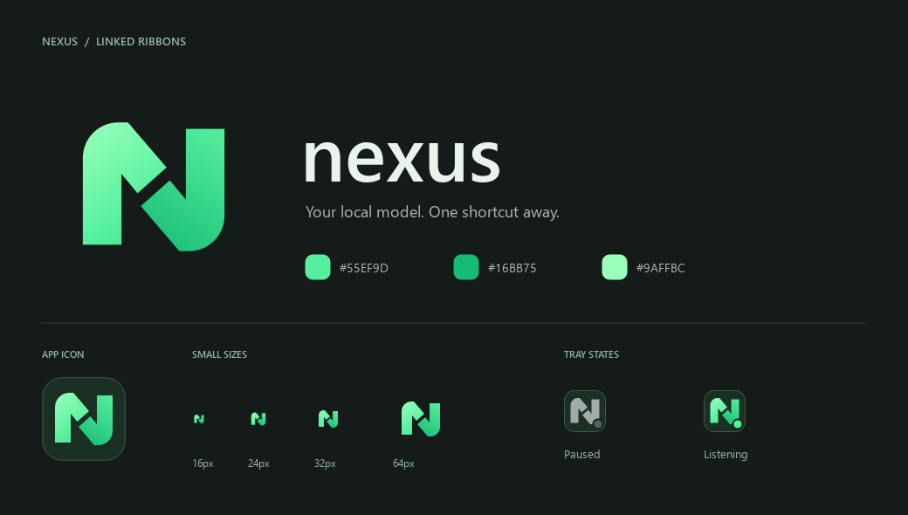

# Nexus visual identity / Görsel kimlik

## English

The mark forms an N from two opposing ribbons, separated by a diagonal cut.
It replaces the thin handwritten-style N with a filled, two-tone silhouette.
The accent is **#55EF9D**, supported by **#16BB75** and **#9AFFBC** on graphite.
Keep the mark's proportions and central cut; do not stretch it or add a glow.

The single vector source is [nexus-mark.svg](../frontend/assets/nexus-mark.svg).
[Transparent PNG](assets/brand/nexus-mark.png) and
[app tile](assets/brand/nexus-app.png) are rendered from that same geometry.
The desktop header, welcome tile, window icon and tray use the shared renderer.
The tray is grey when not listening and green with a status dot while listening;
colour is supplemented by the existing text state and tooltip.

16/24/32/64-pixel previews and larger exports were inspected. Native desktop DPI
and trademark clearance are not established by these rendering checks.

## Türkçe

İşaret, ortada çapraz bir boşlukla ayrılan karşılıklı iki şeritten N oluşturur.
İnce çizgili N yerine dolu, iki tonlu bir siluet kullanılır. Ana vurgu rengi
**#55EF9D**; grafit yüzeylerde **#16BB75** ve **#9AFFBC** ile desteklenir.
Oranları ve ortadaki kesiti koru; logoyu esnetme veya parlama efekti ekleme.

Tek vektör kaynak [nexus-mark.svg](../frontend/assets/nexus-mark.svg) dosyasıdır.
[Şeffaf PNG](assets/brand/nexus-mark.png) ve
[uygulama simgesi](assets/brand/nexus-app.png) aynı geometriden üretilir.
Üst çubuk, karşılama alanı, pencere simgesi ve sistem tepsisi aynı çizimi kullanır.
Tepside dinleme kapalıyken gri; dinlerken durum noktasıyla birlikte yeşil görünür.
Durum ayrıca metin ve ipucuyla açıklanır; yalnızca renge bağlı değildir.

16/24/32/64 piksel önizlemeler ve büyük çıktılar incelendi. Bu kontroller gerçek
masaüstü DPI davranışını veya marka tesciline uygunluğu doğrulamaz.
