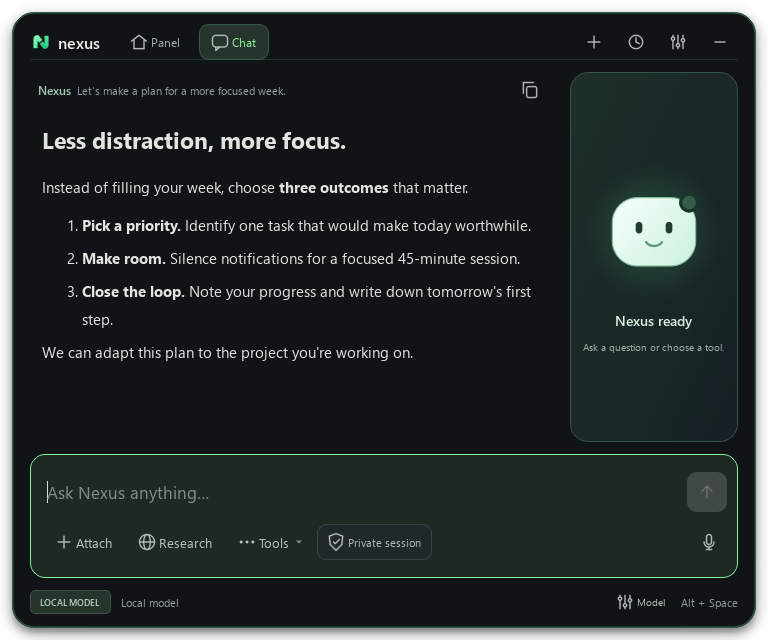
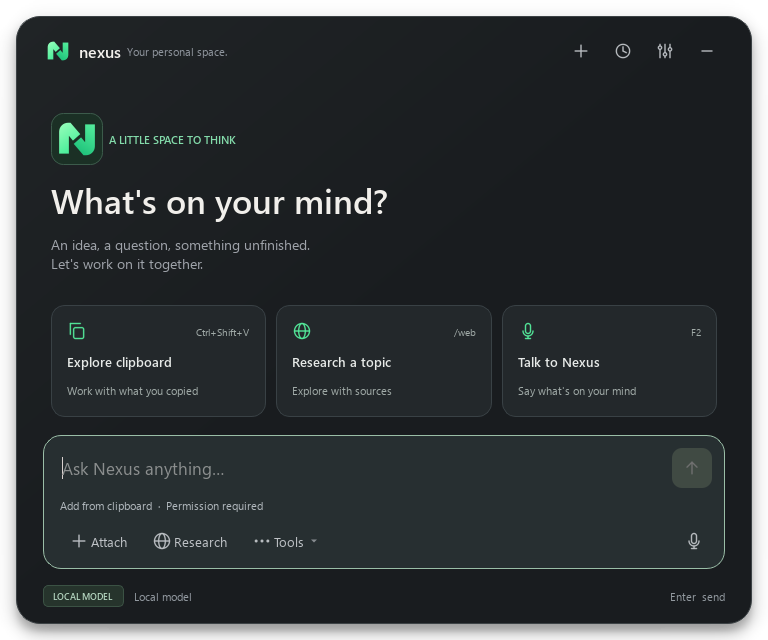
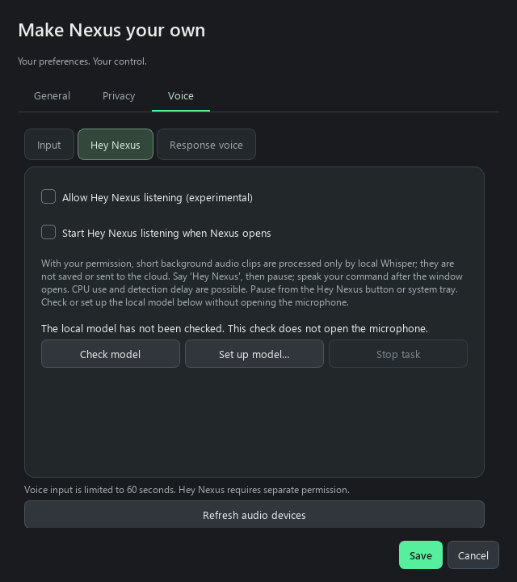
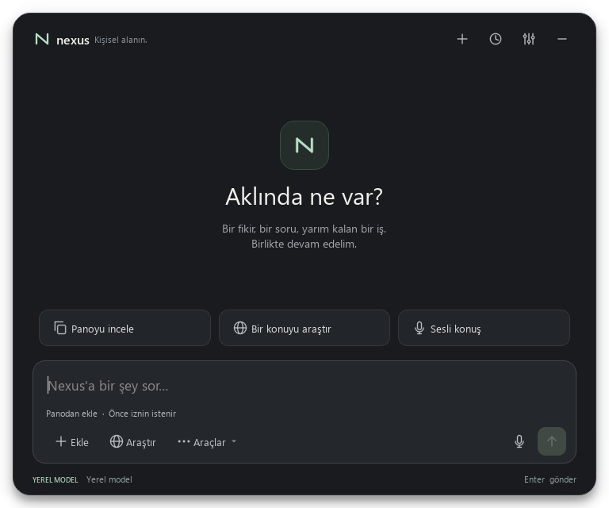
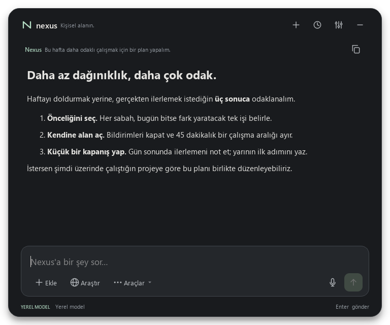

# Desktop interface refresh

The desktop opens as a top-edge strip and expands into a compact panel or chat
workspace. This is an implemented PyQt interface. The smaller panel follows the
provided desktop-assistant video reference while using Nexus's existing features.

- Header: Nexus identity, Panel/Chat views, new conversation, history, settings, and hide.
- Panel: code-drawn companion, actual listening/thinking status, and four controls for
  documents, memory, research and voice. Reduced motion disables the face animation.
- Welcome: a short invitation and three practical starting points.
- Composer: full-width input, attach, research, Tools, visible private-session control,
  microphone, and send. PDF/DOCX/text drops add to the local document library and
  prepare an unsent question; image drops attach the image for the next request.
- Tools: private session, knowledge-grounded answers, response speech, and memory.
- Response: persistent prompt context, copy, and paragraph/list spacing.
- Footer: local/cloud/private disclosure and bounded provider/status text. Wake controls
  remain visible when wake consent is enabled, including during background listening.

Graphite surfaces, warm text, a restrained mint accent, and drawn line icons replace
the purple icon-heavy header. Icons no longer depend on emoji/symbol font availability.
Provider names and errors are elided visually but remain available as tooltips.

Settings has General, Privacy, and Voice tabs; Save/Cancel stays outside scroll areas.
No permission defaults were loosened. Tab and Shift+Tab navigate controls; clipboard
inspection moves to Ctrl+Shift+V. Enter and the send button use the same request path.

## Verification

### Top-edge strip, personalization and memory cards

The current default is a centered 180×36 strip at the available screen's top edge.
After 160 ms of hover it opens a 460×188 preview without activating the editor;
leaving for 350 ms closes it unless pinned or a modal dialog is open. Click/Alt+Space
opens chat. The explicit collapse control preserves recording, workers, draft and
streamed content. Geometry respects taskbars, small screens and negative origins.

Appearance adds exact RGB channels, five presets, a color picker, isolated preview,
an optional slow rainbow edge, and mini bot/cat characters. Dark custom RGB choices
retain their exact glow color while controls use a lighter tint for readability.
RGB, character motion and blink scheduling stop when hidden or under reduced motion.
Chimes are original generated PCM assets, optional and volume-controlled, silent on
hover and streaming chunks. They are independent of speech/microphone permissions.

Memory now has card-based records, readable type/status labels, a scrollable selected
record editor, optional details and a separate saved profile summary. Empty filters
clear the stale editor and disable record actions. Database connections now close
deterministically after transactions; an observed Windows preview cleanup lock is
covered by a file-rename regression check.

325 automated tests and Ruff passed before final packaging. Actual offscreen Qt
animations appear in 36-second portrait and landscape promos with original
synthesized audio. Every frame identifies fictional model/voice states. Physical
microphone, speaker and native high-DPI behavior require separate device checks.
Earlier large-panel iterations below describe prior layouts, superseded by this strip.

### More prominent animation stage

The panel companion grows from 84 to 128 px. Welcome uses a framed 136 px character
beside its invitation. Wide responses keep a 140 px companion in a separate 168 px
side panel; narrow windows use a 64 px character in the response header instead.
The text column retains at least 480 px in the tested full-size layout. Status and
language follow the same live state in every presentation.

Brighter halos, distinct thinking/playback colors, stronger listening rings, longer
orbit trails and larger completion reactions make the motion easier to see. Idle
now has slow breathing while visible; it stops during activity, when hidden, and
under reduced motion. The panel height grows to 426 px to accommodate the character.
These layout changes retain chat text, draft, model selection and permissions.

304 tests and Ruff passed. New checks cover responsive presence visibility,
readable text width, idle motion lifecycle and live accessible state. TR and EN
welcome, response and panel previews were inspected, including a 640x560 window.

### Animated companion and interaction feedback

Panel/Chat changes interpolate native geometry over 230 ms, followed by a short
content reveal. Rapid reversals replace the previous transition; reducing motion,
hiding, or starting a native drag settles the current transition. These changes
do not reset chat workers, streaming text or drafts. Controls use bounded hover
and press feedback without moving their click targets.

The companion has an opening reveal, occasional idle blink, listening rings,
thinking orbits and gaze, and speaking mouth/wave motion. Speaking follows the
actual player state; its wave is a rhythm cue, not an audio amplitude measurement.
Completed answers and added documents trigger a finite bounce/sparkle; failures
trigger a short amber reaction. Cancelled or empty answers do not celebrate.
The companion is also present in the welcome and response header.

A supported local file drag displays a pulsing drop target; leave/drop hides it.
Response activity dots follow real listening/thinking/playback state. All motion,
including blink scheduling, stops when hidden or reduced motion is enabled.
Status text and controls remain usable without motion.

301 automated tests and Ruff passed, including reversal, collection, finite
reactions, keyboard activation, reduced motion, player-state priority, and hidden
animation lifecycle checks. `scripts/preview_motion.py` records real Qt animation
with clearly labelled synthetic states, isolated settings and no model/microphone.
It requires optional preview dependencies PyAV and NumPy. The resulting video stays
in ignored local outputs; native high-DPI and hardware checks remain separate.

### 1 October companion panel

View changes preserve the conversation, draft, attached image and streamed answer.
An answer or document drop opens Chat; returning to Panel preserves the content.
The face and status use existing recording/response signals. No model capability
or permission default changes. Document-drop errors leave the previous draft and
context intact. The preview script now captures `dock.png` as well as chat/settings.

290 automated tests and Ruff passed. A global event filter left on closed windows
caused unhandled callbacks during Python object collection; it is now removed on
close and guarded during teardown, with a collection regression check. EN/TR panel,
chat and compact chat previews were inspected using isolated synthetic content.
Native high-DPI and physical microphone checks remain outside these previews.




### 27 September refinement

The implemented desktop now uses a left-aligned welcome, small action cards with
descriptions/shortcut hints, an input-adjacent send button and a visible focus border.
Cards are real buttons reachable by keyboard; their labels follow saved UI language.
The decorative welcome identity row yields space below 600 px window height, avoiding
clipped actions. The local/cloud/private disclosure remains in the footer.

General and Privacy use grouped cards. Voice has Input, Hey Nexus and Response voice
sections rather than one long form; values and permission choices survive section
switches without being saved. Save/Cancel remains outside scrolling content. Voice
controls support EN/TR; this does not claim all application errors/dialogs are translated.

254 automated tests and Ruff passed. EN/TR welcome, response, settings and voice pages
were rendered from synthetic content; 640x560 main and 560x600 settings previews were
also inspected. A compact-card clipping issue found visually was corrected and the
test now checks parent bounds, not just the outer window. One UI-subset run had a native
Qt access violation at cleanup; reruns passed after explicit test-window disposal.
Its root cause remains open, as do physical high-DPI and screen-reader validation.

Current previews:





### Earlier interface pass

140 automated tests passed, including the existing chat, privacy, voice, and memory
regressions plus five new UI interaction checks. Ruff passed. The known Windows asyncio
pipe-cleanup warning recurred in the final full run; it remains tracked in the roadmap.
Welcome, response, and
all three settings tabs were rendered and visually inspected with temporary settings,
no network calls, and no microphone access. Preview response content is synthetic.

```powershell
.\venv\Scripts\python.exe scripts\preview_ui.py --output docs/assets/ui-refresh
```

The preview tool explicitly loads local Windows fonts when the offscreen Qt platform
cannot discover them. It does not alter installed fonts or live application settings.
Offscreen previews do not prove native high-DPI behavior or screen-reader compatibility;
those checks and user preference feedback remain open.




